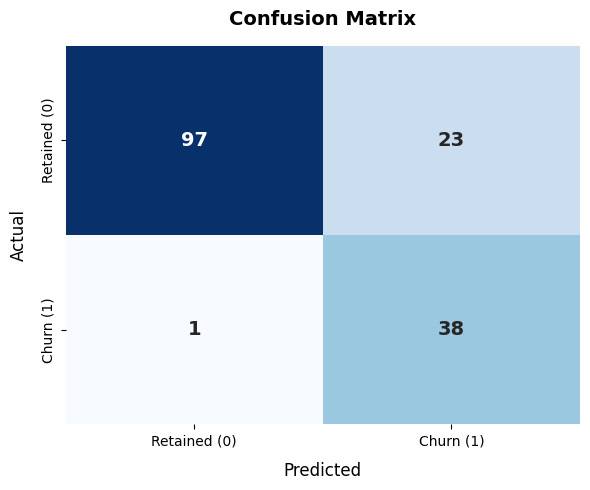
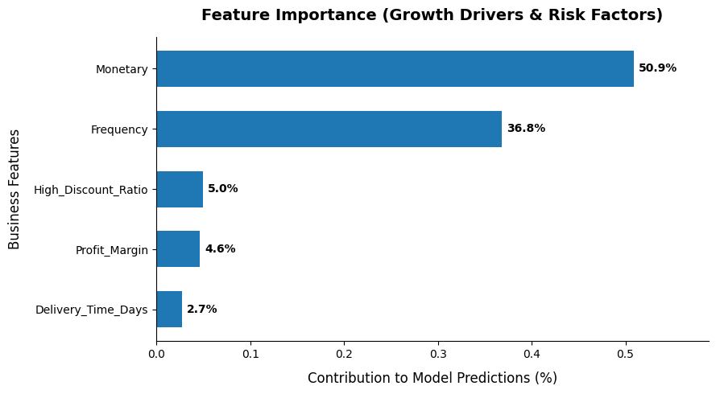
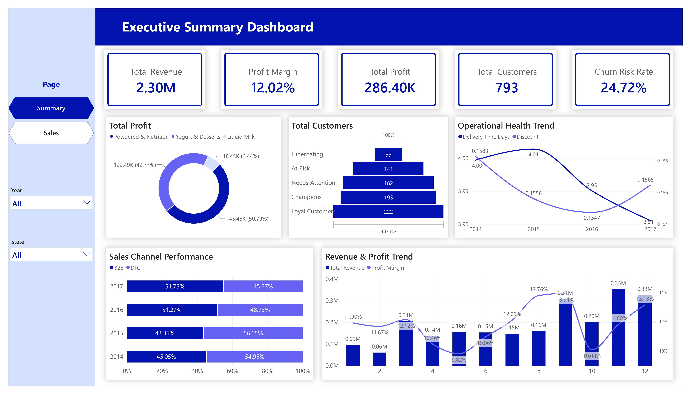
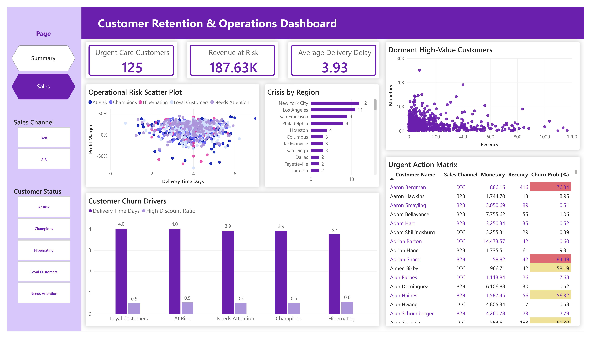

# 📊 FMCG Sales Analytics & Customer Retention: B2B and DTC Channels
(Scroll down for the Vietnamese version / Cuộn xuống để xem bản tiếng Việt)

## 🎯 1. Project Overview & Tech Stack
This project is an end-to-end data pipeline designed for an FMCG enterprise. It transitions raw transactional data into predictive business intelligence, focusing on B2B and DTC channel performance, operational bottlenecks, and proactive customer churn prevention.

**Tech Stack Used:**

* **Data Engineering & EDA:** Python (_pandas_, _numpy_)

* **Machine Learning:** Scikit-Learn (_RandomForestClassifier, GridSearchCV, confusion_matrix_)

* **Data Visualization:** Power BI (Star Schema Data Modeling, Advanced DAX, AI Visuals), _matplotlib_, _seaborn_.

## 🛠️ 2. Data Engineering & Feature Engineering
Raw transaction data rarely provides direct business answers. The critical first step was transforming transactional rows into customer-centric behavioral metrics:

* **Data Cleansing:** Resolved _Mixed Date Formats_ anomalies that caused _NaT_(Null) values during import, ensuring 100% data integrity for time-series analysis.

* **Behavioral Feature Engineering:** Extracted hidden business drivers from the _Fact_Sales_ table:

 **_Delivery_Time_Days_:** Calculated the absolute difference between Order Date and Ship Date to evaluate supply chain efficiency.

 **_Profit_Margin_:** Derived to filter out "toxic revenue" (high sales but negative profit due to excessive support costs).

 **_High_Discount_Ratio_:** Calculated the percentage of a customer's orders that relied on heavy discounts (>15%) to measure price sensitivity.

## 🤖 3. Machine Learning: Churn Prediction & Model Evaluation
The core of this project is moving from descriptive analytics to predictive action. I deployed a Machine Learning model to identify customers highly likely to abandon the brand.

**Algorithm & Optimization (Scikit-Learn):**

* **Imbalanced Data Handling:** Built a _RandomForestClassifier_ utilizing _class_weight='balanced'_ to penalize the model heavily for missing the minority "Churn" class.

* **Hyperparameter Tuning:** Applied _GridSearchCV_ to find the optimal tree depth and estimators, preventing overfitting.

* **Business-Driven Threshold Moving:** By default, ML models use a 0.5 (50%) probability threshold. In Customer Retention, a False Negative (missing a churning customer) is far more costly than a False Positive (over-engaging a loyal one). I strategically lowered the activation threshold to **0.4 (40%)**.

**Model Results & Technical Visualizations:**

* **The Confusion Matrix (Recall Optimization):**

After adjusting the threshold, the model successfully captured 38 out of 39 actual churning customers in the test set. This achieved an outstanding Recall score of 97.4% for the Churn class. The trade-off was 23 False Positives (loyal customers mistakenly flagged), which is a highly acceptable operational cost to save significant at-risk revenue.

* **Feature Importance (Growth Drivers identified by AI):**

The Random Forest algorithm quantified the exact reasons for churn:

1. **Monetary (50.9%) & Frequency (36.8%):** Account for ~88% of the prediction weight. A sudden drop in purchasing cadence from a high-value B2B client is the ultimate red flag.

2. **High_Discount_Ratio (5.0%):** Proves the existence of highly price-sensitive segments; removing subsidies directly triggers churn.

3. **Delivery_Time_Days (2.7%):** While impactful on customer satisfaction, logistics speed was relatively stable and not the primary driver of defection in this dataset.

## 📈 4. BI Dashboards: From Data to Strategy (Power BI)
I constructed a Star Schema data model integrating the Python-processed RFM and ML probability tables. Complex DAX measures (using CALCULATE, Context Transition) were written to ensure dynamic filtering.

* **Dashboard 1: Executive Summary (Macro):**

Provides C-Level executives with a holistic view. It contrasts the steady B2B revenue contribution (45-54%) against DTC, identifies **Liquid Milk (50.79% of profit)** as the cash cow, and flags a macro **Churn Risk Rate of 24.72%**.

* **Dashboard 2: Customer Retention & Operations (Micro):**

An actionable hit-list for the Sales Team. It features an **Urgent Action Matrix** explicitly listing customers with their ML Churn Probability (conditionally formatted in red). It isolates **125 customers** holding **187.63K** in revenue at risk, allowing account managers to deploy targeted rescue campaigns instantly.

## 💡 5. Key Insights & Strategic Recommendations
Synthesizing the ML outputs and BI visualizations, here are the core strategic takeaways for the FMCG business:

1. **Retention over Acquisition:** With nearly 25% of the customer base in the "At Risk" or "Hibernating" RFM segments, the company must temporarily shift marketing budgets from acquiring new DTC users to rescuing existing high-value B2B accounts.

2. **Restructure Sales Boosters:** The ML model identified _High_Discount_Ratio_ as a significant churn driver. The company must transition from flat discounts to "Accumulated Volume Bonuses" to incentivize consistent purchasing Frequency rather than just subsidizing single large orders.

3. **The "Forgotten Goldmines" Campaign:** The Scatter Plot reveals a distinct cluster of VIP customers with extreme Recency (dormant for >400 days) but massive lifetime Monetary value. A specialized, high-tier re-engagement campaign (e.g., exclusive win-back vouchers) should be executed immediately targeting this specific quadrant.

4. **Targeted Logistics Intervention:** The Data proves that "At Risk" customers suffer from delivery delays nearing 4.0 days, and the regional breakdown highlights New York City and Los Angeles as crisis epicenters. Supply chain leaders must audit last-mile delivery partners in these specific geographic zones to stop operational bleeding.
 ---
 

# 📊 Phân tích Kinh doanh & Giữ chân Khách hàng FMCG: Kênh B2B và DTC
## 🎯 1. Tổng quan Dự án & Công nghệ sử dụng
Dự án là một quy trình dữ liệu (Data Pipeline) hoàn chỉnh được thiết kế cho doanh nghiệp tiêu dùng nhanh (FMCG). Dự án chuyển hóa dữ liệu giao dịch thô thành tri thức quản trị, tập trung vào hiệu suất kênh B2B/DTC, điểm nghẽn vận hành và chủ động ngăn chặn rủi ro mất khách hàng.

**Công cụ & Thư viện:**

* **Xử lý dữ liệu (Data Engineering):** Python (_pandas, numpy_)

* **Machine Learning:** Scikit-Learn (_RandomForestClassifier, GridSearchCV, confusion_matrix_)

* **Trực quan hóa (BI):** Power BI (Mô hình Star Schema, DAX nâng cao), _matplotlib, seaborn_.

## 🛠️ 2. Kỹ thuật Xử lý Dữ liệu (Feature Engineering)
Dữ liệu thô không thể trực tiếp giải quyết bài toán kinh doanh. Bước ngoặt của dự án nằm ở việc chuyển đổi các dòng giao dịch thành các biến hành vi khách hàng (Behavioral metrics):

* **Làm sạch dữ liệu:** Xử lý triệt để lỗi _Mixed Date Formats_ gây ra giá trị Null (_NaT_), đảm bảo tính toàn vẹn 100% cho phân tích chuỗi thời gian.

* **Feature Engineering:** Trích xuất các động lực kinh doanh ẩn từ bảng _Fact_Sales_:

 **_Delivery_Time_Days_:** Độ trễ giao hàng trung bình, dùng để đánh giá hiệu suất chuỗi cung ứng.

 **_Profit_Margin_:** Lọc ra các "Doanh thu độc hại" (Khách hàng mua nhiều nhưng chi phí hỗ trợ cao khiến biên lợi nhuận âm).

 **_High_Discount_Ratio_:** Tỷ lệ lạm dụng chiết khấu (>15%), đo lường độ nhạy cảm về giá của từng đại lý.

## 🤖 3. Machine Learning: Dự báo Rời bỏ & Đánh giá Mô hình
Trọng tâm kỹ thuật của dự án là việc chuyển từ phân tích mô tả (Descriptive) sang hành động dự báo (Predictive).

**Thuật toán & Tối ưu hóa (Scikit-Learn):**

* **Xử lý Dữ liệu mất cân bằng (Imbalanced Data):** Thiết lập _class_weight='balanced'_ trong thuật toán _RandomForestClassifier_ nhằm "trừng phạt" mô hình nếu dự đoán sót nhóm khách hàng rời bỏ.

* **Tinh chỉnh Tham số (Hyperparameter Tuning):** Ứng dụng _GridSearchCV_ để dò tìm độ sâu cây và số lượng cây tối ưu, chống Overfitting.

* **Tối ưu Ngưỡng Kinh doanh (Threshold Moving):** Trong bài toán giữ chân khách hàng, việc bỏ sót khách hàng sắp rời đi (False Negative) gây thiệt hại nặng nề hơn rất nhiều so với việc chăm sóc nhầm khách hàng trung thành (False Positive). Tôi đã chủ động hạ ngưỡng kích hoạt (Threshold) từ 0.5 xuống **0.4 (40%)**.

**Kết quả & Phân tích Trực quan:**

* **Ma trận Nhầm lẫn (Tối ưu Recall):**

Sau khi hạ Threshold, mô hình đã "bắt trúng" 38 trên tổng số 39 khách hàng thực sự rời bỏ trong tập Test. Chỉ số Recall đạt mức xuất sắc 97.4%. Sự đánh đổi là 23 False Positives (Báo động nhầm khách hàng đang hoạt động), một mức chi phí vận hành hoàn toàn xứng đáng để cứu vớt hàng trăm ngàn đô la doanh thu rủi ro.

* **Tầm quan trọng của Biến (Feature Importance):**

Thuật toán Random Forest đã định lượng chính xác nguyên nhân khiến đại lý ngừng nhập hàng:

1. **Monetary (50.9%) & Frequency (36.8%):** Quyết định ~88% kết quả dự báo. Việc một đại lý B2B lớn đột ngột giãn cách thời gian nhập hàng là hồi chuông cảnh báo nguy hiểm nhất.

2. **High_Discount_Ratio (5.0%):** Minh chứng cho tệp khách hàng nhạy cảm về giá; việc cắt giảm khuyến mãi sẽ lập tức kích hoạt hành vi rời bỏ.

3. **Delivery_Time_Days (2.7%):** Yếu tố logistics trong bộ dữ liệu này khá ổn định, đóng vai trò thứ yếu trong việc khiến khách hàng rời đi.

## 📈 4. Power BI Dashboards: Trực quan hóa Chiến lược
Mô hình dữ liệu Star Schema được xây dựng để liên kết bảng thô với kết quả từ Python. Hệ thống sử dụng các hàm DAX phức tạp (_CALCULATE, Context Transition_) để tạo ra 2 báo cáo tương tác linh hoạt.

* **Dashboard 1 - Executive Summary (Vĩ mô):**

Dành cho Ban Giám đốc. Trực quan hóa sự ổn định của kênh B2B (đóng góp 45-54% doanh thu), xác định ngành hàng **Sữa Nước (Liquid Milk)** là "cỗ máy in tiền" (**50.79% lợi nhuận**), và cảnh báo **tỷ lệ rủi ro rời bỏ** toàn hệ thống đang ở mức **24.72%**.

* **Dashboard 2 - Customer Retention & Operations (Vi mô):**

Bản đồ tác chiến cho Đội ngũ Sales. Nổi bật với **Ma trận Hành động Khẩn cấp**, liệt kê chính xác tên đại lý đi kèm **Xác suất Rời bỏ (%)** được tô màu đỏ cảnh báo. Giúp Sales Team cô lập ngay **125 khách hàng** đang nắm giữ **187.63K** doanh thu rủi ro để lập tức gọi điện cứu vớt.

## 💡 5. Kết luận & Khuyến nghị Chiến lược (Key Insights & Recommendations)
Tổng hợp từ dữ liệu Machine Learning và Power BI, dưới đây là các đề xuất hành động cốt lõi cho doanh nghiệp:

1. **Ưu tiên Giữ chân hơn Thu hút mới:** Với gần 25% tệp khách hàng đang nằm ở phân khúc RFM "At Risk" và "Hibernating", công ty cần chuyển dịch ngân sách Marketing hiện tại sang việc cứu vớt các đại lý B2B giá trị cao đang có dấu hiệu suy thoái.

2. **Tái cấu trúc Chính sách Chiết khấu:** Thuật toán ML chỉ ra _High_Discount_Ratio_ là nguyên nhân lớn gây rời bỏ. Cần chuyển từ hình thức "Chiết khấu trực tiếp trên đơn" sang "Thưởng tích lũy doanh số", nhằm ép đại lý duy trì Tần suất (Frequency) nhập hàng liên tục thay vì chỉ "săn sale" đơn lẻ.

3. **Chiến dịch "Mỏ vàng bị lãng quên":** Biểu đồ Scatter Plot phát hiện một cụm khách hàng VIP cực lớn nhưng đã ngủ đông hơn 400 ngày. Cần lập tức khởi chạy một chiến dịch Win-back Campaign (Tặng voucher độc quyền trị giá lớn) nhắm thẳng vào góc phần tư này để tái kích hoạt dòng tiền.

4. **Can thiệp Vận hành cục bộ:** Dữ liệu chứng minh nhóm At Risk phải chịu đựng số ngày chờ giao hàng xấp xỉ 4 ngày. Bản đồ nhiệt khu vực chỉ đích danh New York City và Los Angeles là tâm điểm khủng hoảng. Giám đốc chuỗi cung ứng cần lập tức rà soát và thay thế các đối tác vận tải (Last-mile delivery) tại hai địa bàn này để chặn đứng đà mất khách.

5. *Thực hiện bởi: **Bùi Thị Phước Trâm** - Data Analyst Portfolio*
